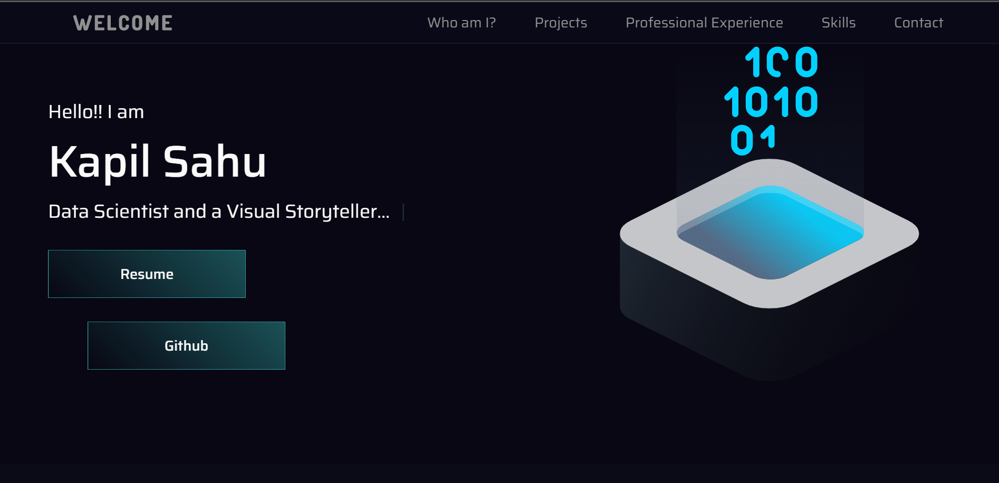

<h1 align="center">
  💻 Portfolio - Kapil Sahu
</h1>

<h4 align="center"><a href="https://www.kapilsahukp.github.io/">Click to visit project</a></h4>

## 📚 Sections

The website consists of five sections:

- **Home:** In it we have a brief presentation;
- **About me:** In this section I have a description telling a little about who I am;
- **Projects:** It presents some developed projects with a direct link to the respective codes on GitHub;
- **Professional Experience:** Displays through cards, my previous and current work experience;
- **Skills:** Displays through cards, my skills;
- **Contact:** My email id and linkedin profile;

---

## 💼 Technologies used

For the development of this site I used the following technologies:

- HTML;
- Sass;
- JavaScript;
- ScrollReveal;
- SVG Inject;
- Typed.js;

---

<h2>Author</h2>

<table>
  <tr>
    <td align="center">
      <a href="https://github.com/kapilsahukp">
        
          <b>Kapil Sahu</b>
        
      </a>
    </td>
  </tr>
</table>
